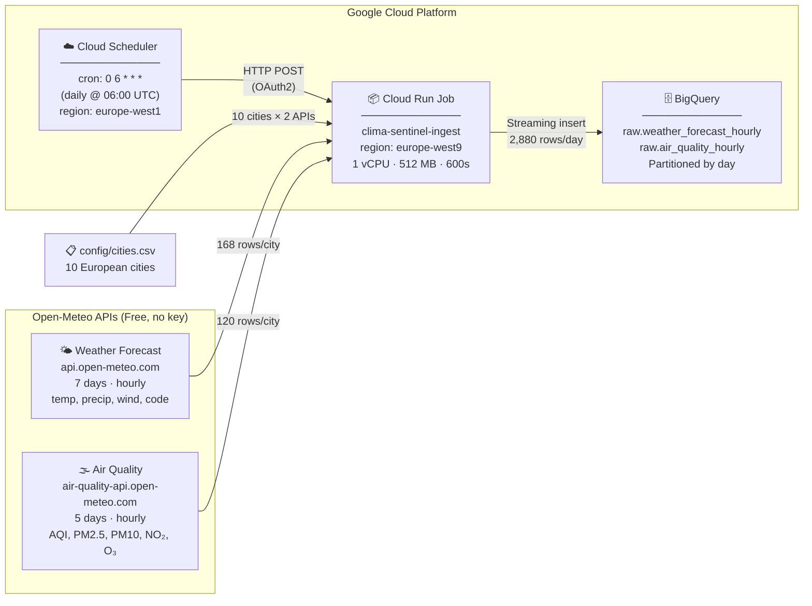

# ClimaSentinel

## Quick Start

```bash
git clone https://github.com/Selim-Abouleila/ClimaSentinel.git
cd ClimaSentinel
cp .env.example .env   # then fill in GCP_PROJECT_ID
```

**First time — initialise the Terraform state backend:**
```bash
make bootstrap
```

**Deploy GCP resources:**
```bash
make deploy
```

See the full guide in [docs/1-bootstrap-initialization.md](docs/1-bootstrap-initialization.md).

### All commands

| Command | Description |
|---|---|
| `make bootstrap` | Create GCS state bucket & init Terraform backend |
| `make deploy` | `terraform plan` + `terraform apply` |
| `make plan` | Dry run — show changes without applying |
| `make destroy` | Tear down all GCP resources |

---

## Architecture



---

## Docs

| Document | Description |
|---|---|
| [1. Bootstrap Initialization](docs/1-bootstrap-initialization.md) | How to clone this project in GCP Cloud Shell and initialize the Terraform remote state backend |
| [2. Ingestion Pipeline](docs/2-ingestion-pipeline.md) | Details on the Cloud Run and BigQuery pipeline architecture and real-time APIs fetched |