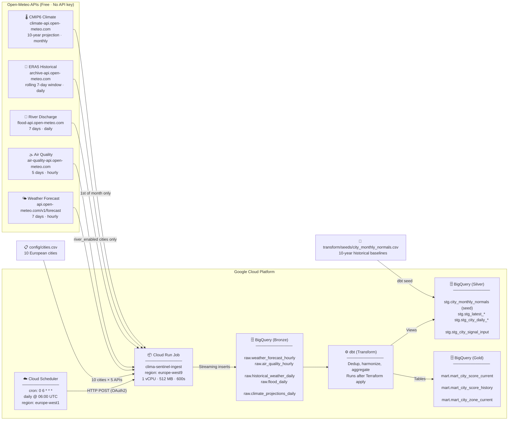

# ClimaSentinel


ClimaSentinel is an automated climate data pipeline running on Google Cloud Platform. It ingests real-time weather, air quality, river discharge, historical ERA5 reanalysis, and long-term CMIP6 climate projections for 10 major European cities — every day, at zero marginal cost.


---

## Team

| Role | Members | Main Mission | Tools |
|---|---|---|---|
| **DE1 / Lead** | Selim Abouleila | Terraform, deployments, integration, unblocking issues | GitHub, Terraform, Cloud Run, BigQuery |
| **DE2** | Anaïs Robert | Ingestion code and raw data modelling | Python, Cloud Run, BigQuery |
| **DA1** | Begum Sozer, Rhita Moum, Nathan Germany | Scoring logic, datamart tables (business layer), dashboard | BigQuery SQL, Power BI, Streamlit |
| **DA2** | Nathan Germany, Xan Doyhenart | Data validation, quality checks, Monday docs & deliverables | BigQuery SQL, Power BI, Streamlit, docs, spreadsheets |

---

## Quick Start

```bash
git clone https://github.com/Selim-Abouleila/ClimaSentinel.git
cd ClimaSentinel
cp .env.example .env   # then fill in GCP_PROJECT_ID
```

**First time — initialise the Terraform state backend:**
```bash
make bootstrap
```

**Deploy GCP resources:**
```bash
make deploy
```

See the full guide in [docs/1-bootstrap-initialization.md](docs/1-bootstrap-initialization.md).

### All commands

| Command | Description |
|---|---|
| `make bootstrap` | Enable GCP APIs, create Artifact Registry repo, GCS state bucket, init Terraform |
| `make build` | Build & push the ingest Docker image via Cloud Build |
| `make deploy` | Full pipeline: build image + terraform apply + dbt run + dbt test |
| `make plan` | Dry run — show changes without applying |
| `make destroy` | Tear down all GCP resources |
| `make dbt-stg` | Run staging dbt models only |
| `make dbt-test` | Run dbt schema tests |

---

## Architecture



---

## Data Sources

| API | Endpoint | Grain | Rows/city/day | Table |
|---|---|---|---|---|
| Weather Forecast | `api.open-meteo.com/v1/forecast` | Hourly | 168 | `raw.weather_forecast_hourly` |
| Air Quality | `air-quality-api.open-meteo.com/v1/air-quality` | Hourly | 120 | `raw.air_quality_hourly` |
| River Discharge | `flood-api.open-meteo.com/v1/flood` | Daily | 7 | `raw.flood_daily` |
| ERA5 Historical | `archive-api.open-meteo.com/v1/archive` | Daily | 7 | `raw.historical_weather_daily` |
| CMIP6 Climate | `climate-api.open-meteo.com/v1/climate` | Daily | ~3,650/mo | `raw.climate_projections_daily` |

---

## BigQuery Datasets (Medallion Architecture)

| Layer | Dataset | Purpose | Key Tables | Status |
|---|---|---|---|---|
| 🥉 Bronze | `raw` | Raw API loads — append-only, partitioned by day | `weather_forecast_hourly`, `air_quality_hourly`, `flood_daily`, `historical_weather_daily`, `climate_projections_daily` | ✅ Live |
| 🥈 Silver | `stg` | Static seeds and harmonized daily views (dbt) | `city_monthly_normals` (table), `stg_city_daily_weather`, `stg_city_signal_input` | ✅ Live |
| 🥇 Gold | `mart` | Tipping scores, city ranking, driver attribution | `mart_city_score_current`, `mart_city_score_history`, `mart_city_zone_current` | ✅ Live |

> **Bronze** tables are auto-created by the ingest job. **Silver** and **Gold** models are managed by dbt and deployed via `make deploy`.

---

## Cities

| City | Country | Lat | Lon | River monitoring |
|---|---|---|---|---|
| Paris | FR | 48.853 | 2.348 | ✅ |
| London | GB | 51.508 | −0.125 | — |
| Madrid | ES | 40.416 | −3.702 | — |
| Berlin | DE | 52.524 | 13.410 | — |
| Rome | IT | 41.891 | 12.511 | — |
| Amsterdam | NL | 52.374 | 4.889 | ✅ |
| Athens | GR | 37.983 | 23.727 | — |
| Warsaw | PL | 52.229 | 21.011 | ✅ |
| Lisbon | PT | 38.716 | −9.133 | — |
| Stockholm | SE | 59.329 | 18.068 | — |

---

## Docs

| Document | Description |
|---|---|
| [1. Bootstrap Initialization](docs/1-bootstrap-initialization.md) | How to clone this project in GCP Cloud Shell and initialize the Terraform remote state backend |
| [2. Ingestion Pipeline](docs/2-ingestion-pipeline.md) | Details on the Cloud Run and BigQuery pipeline architecture and the 5 Open-Meteo APIs fetched |
| [3. Staging Layer](docs/3-staging-layer.md) | Silver layer: dbt deduplication, daily aggregation, and the unified `city_signal_input` view |
| [4. Mart Layer](docs/4-mart-layer.md) | Gold layer: Tipping Score mathematical logic, velocity math, and ranking views in the `mart` dataset |
| [5. Guide Power BI](docs/5-guide-powerbi.md) | Guide en français pour connecter Power BI Desktop aux tables `mart` et configurer le rafraîchissement automatique |
| [6. Guide Streamlit](docs/6-guide-streamlit.md) | Guide en français pour créer un dashboard Python Streamlit connecté à BigQuery avec le même compte de service |