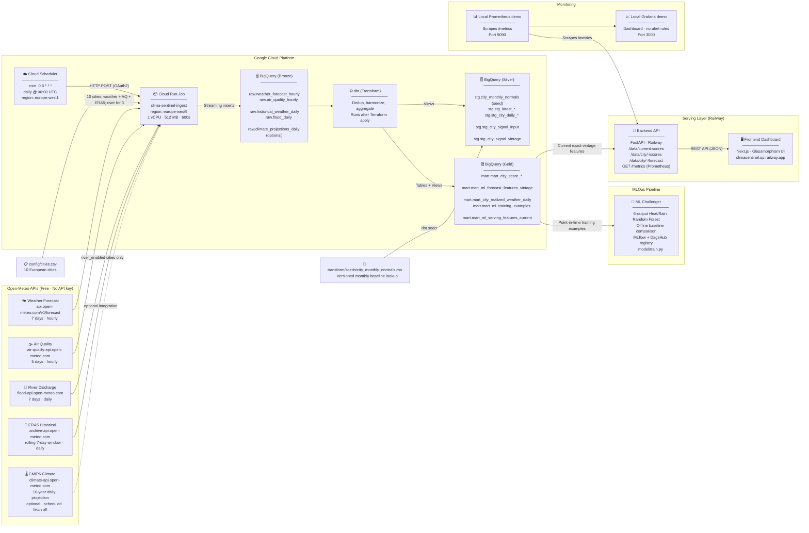

# ClimaSentinel

<div align="center">
  
  <br>
  <sub>Illustrative project artwork; not live forecast evidence.</sub>
</div>

**🌍 Live Dashboard:** [climasentinel.up.railway.app](https://climasentinel.up.railway.app/)

ClimaSentinel combines a serverless GCP climate-data pipeline with a FastAPI and Next.js serving layer on Railway. It ingests daily weather, air-quality and river-discharge forecasts plus lagged ERA5 reanalysis for 10 major European cities, transforms them with BigQuery and dbt, and supports an optional monthly CMIP6 projection source that is currently disabled in scheduled ingestion.

> **Forecasting is beta.** The three-day page presents experimental Day +1/+2/+3 point estimates from deterministic same-vintage rules, not a deployed ML model. Heat has limited ERA5 backtest evidence; Rain was ERA5-backtested but showed insufficient skill; Wind, Air Quality and River are not observation-validated. Missing inputs remain unavailable, and no confidence intervals are claimed.

---

## Team

| Role | Members | Main Mission | Tools |
|---|---|---|---|
| **DE1 / Lead** | Selim Abouleila | Terraform, deployments, integration, unblocking issues | GitHub, Terraform, Cloud Run, BigQuery |
| **DE2** | Anaïs Robert | Ingestion code and raw data modelling | Python, Cloud Run, BigQuery |
| **DA1** | Begum Sozer, Rhita Moum, Nathan Germany | Scoring logic, datamart tables (business layer), dashboard | BigQuery SQL, Power BI, Streamlit |
| **DA2** | Nathan Germany, Xan Doyhenart | Data validation, quality checks, Monday docs & deliverables | BigQuery SQL, Power BI, Streamlit, docs, spreadsheets |

---

## Quick Start

> **Existing-environment workflow.** The current Terraform does not create the
> BigQuery `raw` dataset, and `make deploy` runs dbt before a first ingestion can
> create the source tables. The commands below therefore update an environment
> whose Bronze layer has already been initialized; they are not yet a clean-room
> bootstrap. See [Doc 1](docs/1-bootstrap-initialization.md) for the prerequisite
> and safe deployment order.

```bash
git clone https://github.com/Selim-Abouleila/ClimaSentinel.git
cd ClimaSentinel
cp .env.example .env   # then fill in GCP_PROJECT_ID
```

**First time — initialise the Terraform state backend:**
```bash
make bootstrap
```

**Review the Terraform plan, then deploy the initialized environment:**
```bash
make plan
make deploy
```

See the full guide in [docs/1-bootstrap-initialization.md](docs/1-bootstrap-initialization.md).

### All commands

| Command | Description |
|---|---|
| `make bootstrap` | Enable GCP APIs, create Artifact Registry repo, GCS state bucket, init Terraform |
| `make build` | Build & push the ingest Docker image via Cloud Build |
| `make deploy` | Build/push image, create and automatically apply a saved Terraform plan, then run dbt seed/run/test |
| `make plan` | Dry run — show changes without applying |
| `make destroy` | Destroy Terraform-managed resources only; it does not remove the state bucket, Artifact Registry/images, BigQuery data, enabled APIs, or other imperatively created resources |
| `make dbt-stg` | Run staging dbt models only |
| `make dbt-test` | Run dbt schema and singular data tests |

---

## Architecture


```mermaid
flowchart LR
    subgraph GCP["Google Cloud Platform"]
        direction LR
        SCH["☁️ Cloud Scheduler
        ─────────────
        cron: 0 6 * * *
        daily @ 06:00 UTC
        region: europe-west1"]

        CRJ["📦 Cloud Run Job
        ─────────────
        clima-sentinel-ingest
        region: europe-west9
        1 vCPU · 512 MB · 600s"]

        BQ_RAW["🗄️ BigQuery (Bronze)
        ─────────────
        raw.weather_forecast_hourly
        raw.air_quality_hourly
        raw.historical_weather_daily
        raw.flood_daily
        raw.climate_projections_daily (optional)"]

        DBT["⚙️ dbt (Transform)
        ─────────────
        Dedup, harmonize, aggregate
        Runs after Terraform apply"]

        BQ_STG["🗄️ BigQuery (Silver)
        ─────────────
        stg.city_monthly_normals (seed)
        stg.stg_latest_*
        stg.stg_city_daily_*
        stg.stg_city_signal_input
        stg.stg_city_signal_vintage"]

        BQ_MART["🗄️ BigQuery (Gold)
        ─────────────
        mart.mart_city_score_*
        mart.mart_ml_forecast_features_vintage
        mart.mart_city_realized_weather_daily
        mart.mart_ml_training_examples
        mart.mart_ml_serving_features_current"]

        SCH -->|"HTTP POST (OAuth2)"| CRJ
        CRJ -->|"Streaming inserts"| BQ_RAW
        BQ_RAW --> DBT
        DBT -->|"Views"| BQ_STG
        DBT -->|"Tables + Views"| BQ_MART
    end

    subgraph APIs["Open-Meteo APIs (Free · No API key)"]
        direction TB
        W["🌤️ Weather Forecast
        api.open-meteo.com/v1/forecast
        7 days · hourly"]

        AQ["🌫️ Air Quality
        air-quality-api.open-meteo.com
        5 days · hourly"]

        FL["🌊 River Discharge
        flood-api.open-meteo.com
        7 days · daily"]

        HW["📅 ERA5 Historical
        archive-api.open-meteo.com
        rolling 7-day window · daily"]

        CP["🌡️ CMIP6 Climate
        climate-api.open-meteo.com
        10-year daily projection
        optional · scheduled fetch off"]
    end

    subgraph SERVING["Serving Layer (Railway)"]
        direction TB
        BACKEND["🚀 Backend API
        ─────────────
        FastAPI · Railway
        /data/current-scores
        /data/city/·/scores
        /data/city/·/forecast
        GET /metrics (Prometheus)"]

        FRONTEND["🖥️ Frontend Dashboard
        ─────────────
        Next.js · Glassmorphism UI
        climasentinel.up.railway.app"]
    end

    subgraph MLOPS["MLOps Pipeline"]
        direction TB
        ML["🧪 ML Challenger
        ─────────────
        6-output Heat/Rain Random Forest
        Offline baseline comparison
        MLflow + DagsHub registry
        model/train.py"]
    end

    subgraph MON["Monitoring"]
        direction TB
        PROM["📊 Local Prometheus demo
        ─────────────
        Scrapes /metrics
        Port 9090"]

        GRAF["📈 Local Grafana demo
        ─────────────
        Dashboard · no alert rules
        Port 3000"]

        PROM --> GRAF
    end

    CITIES["📋 config/cities.csv
    10 European cities"]

    NORMALS["🌱 transform/seeds/city_monthly_normals.csv
    Versioned monthly baseline lookup"]

    CITIES -->|"10 cities: weather + AQ + ERA5; river for 3"| CRJ
    NORMALS -->|"dbt seed"| BQ_STG
    W  --> CRJ
    AQ --> CRJ
    FL -->|"river_enabled cities only"| CRJ
    HW --> CRJ
    CP -.->|"optional integration"| CRJ
    BQ_MART -->|"Current exact-vintage features"| BACKEND
    BACKEND -->|"REST API (JSON)"| FRONTEND
    BQ_MART -->|"Point-in-time training examples"| ML
    PROM -->|"Scrapes /metrics"| BACKEND
```

---

## Data Sources

| API | Endpoint | Grain | Typical rows/city/run | Table |
|---|---|---|---|---|
| Weather Forecast | `api.open-meteo.com/v1/forecast` | Hourly | 168 | `raw.weather_forecast_hourly` |
| Air Quality | `air-quality-api.open-meteo.com/v1/air-quality` | Hourly | 120 | `raw.air_quality_hourly` |
| River Discharge | `flood-api.open-meteo.com/v1/flood` | Daily | 7 | `raw.flood_daily` |
| ERA5 Historical | `archive-api.open-meteo.com/v1/archive` | Daily | 7 | `raw.historical_weather_daily` |
| CMIP6 Climate (integration present; scheduled fetch disabled; no mart consumer) | `climate-api.open-meteo.com/v1/climate` | Daily | ~3,650 when invoked | `raw.climate_projections_daily` |

The hourly weather and air-quality timestamps are provider-local clock values
stored in a field named `valid_ts_utc`; no source offset is retained. Do not use
that field for exact absolute lead-time or DST auditing. Current horizon logic
uses city-local calendar dates as a mitigation, not as a timestamp correction.

---

## BigQuery Datasets (Medallion Architecture)

| Layer | Dataset | Purpose | Key Tables | Status |
|---|---|---|---|---|
| 🥉 Bronze | `raw` | Raw API loads — append-only, partitioned by day | Active: `weather_forecast_hourly`, `air_quality_hourly`, `flood_daily`, `historical_weather_daily`; optional: `climate_projections_daily` | Configured; dataset existence and freshness require runtime verification |
| 🥈 Silver | `stg` | Static seeds, operational daily views, and exact forecast vintages (dbt) | `city_monthly_normals`, `stg_latest_*`, `stg_city_signal_input`, `stg_city_signal_vintage` | dbt-managed; deployment and freshness require runtime verification |
| 🥇 Gold | `mart` | Operational scores, exact-vintage forecast features, and ERA5-backed Heat/Rain labels | `mart_city_score_*`, `mart_ml_forecast_features_vintage`, `mart_city_realized_weather_daily`, `mart_ml_training_examples`, `mart_ml_serving_features_current` | dbt-managed; deployment and freshness require runtime verification |

> The ingest job creates active-source **Bronze tables only after the `raw`
> dataset exists**. **Silver** and **Gold** models are managed by dbt. A
> scheduled ingest can still finish green when its embedded dbt step fails, and
> scheduled runs do not execute `dbt test`; verify mart freshness independently.

---

## Cities

| City | Country | Lat | Lon | River monitoring |
|---|---|---|---|---|
| Paris | FR | 48.853 | 2.348 | ✅ |
| London | GB | 51.508 | −0.125 | — |
| Madrid | ES | 40.416 | −3.702 | — |
| Berlin | DE | 52.524 | 13.410 | — |
| Rome | IT | 41.891 | 12.511 | — |
| Amsterdam | NL | 52.374 | 4.889 | ✅ |
| Athens | GR | 37.983 | 23.727 | — |
| Warsaw | PL | 52.229 | 21.011 | ✅ |
| Lisbon | PT | 38.716 | −9.133 | — |
| Stockholm | SE | 59.329 | 18.068 | — |

---

## CI/CD Pipeline & Model Promotion

ClimaSentinel documents a four-tier branching strategy (`feature/*` → `dev` →
`staging` → `main`) and validates it with GitHub Actions. Branch protection is
configured outside the repository and must be verified in GitHub:

1. **PR validation (`dev`):** Runs Python unit and integration tests, frontend lint/build checks, and a Docker build.
2. **Staging environment (`staging`):** Extracts a point-in-time snapshot, trains and evaluates the six-output Heat/Rain challenger, and deploys the transparent all-rule baseline. Railway deployments run in attached mode; CI verifies the frontend release marker before a limited Chromium/Paris Playwright path exercises all three horizons. Training jobs do not currently receive GitHub Environment isolation, and staging promotion can move the shared MLflow `Production` stage/`champion` alias.
3. **Production gate (`main`):** A candidate must have non-negative component R², beat the exact matching rule MAE by at least 5%, and satisfy horizon-aware absolute MAE ceilings. Authentication, provenance or artifact-contract failures remain fatal. Railway production deployment is currently disabled, and the operational response continues to serve all five same-vintage rules without model intervals.

PR and staging CI do not currently exercise source fetchers, BigQuery loader
writes or dbt compile/run/test; see [Doc 7](docs/7-cicd-and-branching.md) for
the tested boundaries.

*For full details on our pipelines and quality gates, please see [Doc 7: CI/CD and Branching Strategy](docs/7-cicd-and-branching.md).*

---

## Reproducibility

The repository contains the main ingredients for traceable runs, with important
current limits:

- **Infrastructure:** Cloud Run, Scheduler, service accounts and IAM are in
  Terraform. The state bucket, Artifact Registry and `raw` dataset lifecycle are
  outside that state, so Quick Start is not a complete clean-room recreation.
- **Data transformations:** dbt defines Silver and Gold, but requires initialized
  Bronze sources and successful credentials/source access.
- **Machine learning:** MLflow records runs, but the DVC pointer on the current
  `dev` line is a legacy snapshot that predates the schema-v3 six-output
  training contract. Workflow-generated pointer commits are branch-local, so
  inspect the exact revision being run. `dvc pull` alone does not reproduce the
  current challenger from `dev`; regenerate and version a compatible snapshot
  before claiming exact reproduction.

*For details on reproducing the ML pipelines or testing, refer to [Doc 11: Machine Learning Model](docs/11-machine-learning-model.md) and [Doc 13: End-to-End Testing](docs/13-end-to-end-testing.md).*

---

## Docs

| Document | Description |
|---|---|
| [1. Bootstrap Initialization](docs/1-bootstrap-initialization.md) | How to clone this project in GCP Cloud Shell and initialize the Terraform remote state backend |
| [2. Ingestion Pipeline](docs/2-ingestion-pipeline.md) | Cloud Run and BigQuery ingestion architecture, source contracts, and fetch cadences |
| [3. Staging Layer](docs/3-staging-layer.md) | Silver layer: operational latest views plus exact-run weather, AQ, flood and unified signal vintages |
| [4. Mart Layer](docs/4-mart-layer.md) | Gold layer: operational scores plus point-in-time-safe ML feature, realized-label, training, and serving marts |
| [5. Guide Power BI](docs/5-guide-powerbi.md) | Guide en français pour connecter Power BI Desktop aux tables `mart` et configurer le rafraîchissement automatique |
| [6. Guide Streamlit](docs/6-guide-streamlit.md) | Guide en français pour connecter Streamlit à BigQuery avec une identité dédiée et des secrets gérés |
| [7. CI/CD and Branching Strategy](docs/7-cicd-and-branching.md) | Intended branch flow, GitHub Actions behavior, secret scope, and current deployment/registry limitations |
| [8. Backend Architecture](docs/8-backend.md) | FastAPI, exact-vintage rule serving, offline challenger boundary, and Dockerization |
| [9. Frontend Architecture](docs/9-frontend.md) | Next.js dashboard, beta rule-forecast UI, and transparent validation presentation |
| [10. Monitoring Dashboard](docs/10-monitoring-dashboard.md) | Local Prometheus + Grafana observability demo, its metric semantics, and production gaps |
| [11. Machine Learning Model](docs/11-machine-learning-model.md) | Six-output realized Heat/Rain challenger, purged validation, rule baselines, MLflow, and DagsHub registry |
| [12. API Swagger Documentation](docs/12-api-swagger-documentation.md) | FastAPI endpoint reference, typed forecast contract, raw operational routes, and current hardening gaps |
| [13. End-to-End Testing](docs/13-end-to-end-testing.md) | Frontend-marker-pinned Paris/Chromium staging smoke test and its coverage limits |
| [Archived project material](docs/archive/README.md) | Dated, superseded project artifacts retained with provenance and use restrictions |
