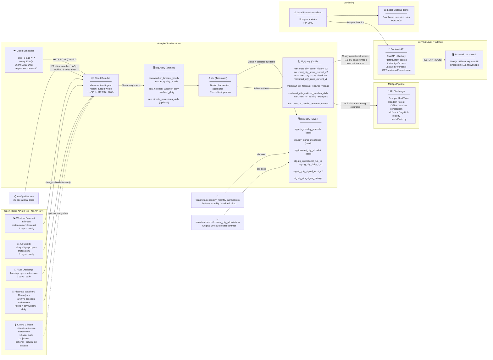

# ClimaSentinel

<div align="center">
  
  <br>
  <sub>This artwork is illustrative and does not show live forecast data.</sub>
</div>

**🌍 Live Dashboard:** [climasentinel.up.railway.app](https://climasentinel.up.railway.app/)

ClimaSentinel is a climate-data platform. It uses a serverless pipeline on
Google Cloud and serves data through a FastAPI backend and a Next.js frontend
on Railway.

The pipeline runs at 06:00 and 18:00 UTC. It collects weather and air-quality
forecasts for 20 major European cities. It also collects lagged historical and
reanalysis weather data from the Open-Meteo Archive API. River-discharge
forecasts are enabled for five cities. BigQuery stores the data, and dbt
transforms it.

The project can also ingest monthly CMIP6 projections. Scheduled CMIP6
ingestion is disabled, and no mart currently uses these projections. The
operational dashboard covers all 20 cities once the latest data-pipeline and
serving releases are deployed. The beta forecast remains limited to its
original 10-city allowlist.

The v2 operational models keep missing monitored inputs as NULL. They
distinguish `unavailable` data from signals that are `not_monitored`. They also
show input coverage and calculate each city score using only the available
factors.

The v2 API includes the ID and timestamp of the selected operational run. The
overview and detail pages show data from that snapshot. They warn when it is
more than 36 hours old and flag scored cities with partial factor coverage.
This provides visibility into the selected snapshot, but it is not a complete
run audit because the pipeline does not save a permanent run manifest.

> **Forecasting is beta.** The three-day page shows experimental point
> estimates for Day +1, Day +2 and Day +3. These estimates come from
> deterministic rules that use data from the same retrieval. They do not come
> from a deployed ML model.
>
> Backtests against Open-Meteo archive and reanalysis data provide limited
> support for Heat. Rain did not show enough predictive skill. Wind, Air Quality
> and River have not been validated against observations. Missing inputs remain
> unavailable, and no confidence intervals are provided.

---

## Team

| Role | Members | Main Mission | Tools |
|---|---|---|---|
| **DE1 / Lead** | Selim Abouleila | Terraform, deployments, integration, unblocking issues | GitHub, Terraform, Cloud Run, BigQuery |
| **DE2** | Anaïs Robert | Ingestion code and raw data modelling | Python, Cloud Run, BigQuery |
| **DA1** | Begum Sozer, Rhita Moum, Nathan Germany | Scoring logic, datamart tables (business layer), dashboard | BigQuery SQL, Power BI, Streamlit |
| **DA2** | Nathan Germany, Xan Doyhenart | Data validation, quality checks, Monday docs & deliverables | BigQuery SQL, Power BI, Streamlit, docs, spreadsheets |

---

## Quick Start

> **BigQuery prerequisite.** Terraform does not create the BigQuery `raw`
> dataset. Create it once by following
> [Doc 1](docs/1-bootstrap-initialization.md). After that, `make deploy`
> validates the city files, applies Terraform, runs the ingestion job and waits
> for it to finish. It then runs `dbt seed`, `dbt run` and `dbt test`.

```bash
git clone https://github.com/Selim-Abouleila/ClimaSentinel.git
cd ClimaSentinel
cp .env.example .env   # then fill in GCP_PROJECT_ID
```

**First time — initialise the Terraform state backend:**
```bash
make bootstrap
```

**Review the Terraform plan, then deploy the initialized environment:**
```bash
make plan
make deploy
```

`make deploy` updates only the GCP ingestion and dbt pipeline. It does not
deploy the FastAPI or Next.js services to Railway. To publish those services,
promote the reviewed commit from `dev` to `staging`. This starts the
repository's Railway deployment workflow.

For the availability-contract rollout, run `make deploy` first. This creates
the new v2 relations while keeping the unsuffixed legacy relations live for
rollback.

The staging workflow then queues the backward-compatible frontend with
`--detach`, so it does not wait for the Railway build to finish. While Railway
builds the frontend, the workflow checks the v2 schemas, coverage for all 20
cities, selected-run consistency and the 36-hour snapshot age limit. It also
verifies the frontend's exact commit and run marker within a strict 10-minute
deadline. Only after these checks pass does it queue the v2 backend.

A second time-limited check polls the frontend's no-cache backend-health proxy.
End-to-end tests start only when the backend reports exactly the same release
ID.

See the full guide in [docs/1-bootstrap-initialization.md](docs/1-bootstrap-initialization.md).

### All commands

| Command | Description |
|---|---|
| `make bootstrap` | Enable GCP APIs, create Artifact Registry repo, GCS state bucket, init Terraform |
| `make build` | Build & push the ingest Docker image via Cloud Build |
| `make validate-cities` | Validate the operational registry, 12 monthly normals per active city, signal-monitoring contract, and frozen forecast-city contract |
| `make deploy` | Validate city files, build/push, apply Terraform, execute and wait for ingestion, then run dbt seed/run/test |
| `make plan` | Dry run — show changes without applying |
| `make destroy` | Destroy only resources managed by Terraform. This does not remove the state bucket, Artifact Registry images, BigQuery data, enabled APIs or other resources created outside Terraform. |
| `make dbt-stg` | Run staging dbt models only |
| `make dbt-test` | Run dbt schema and singular data tests |

---

## Architecture


```mermaid
flowchart LR
    subgraph GCP["Google Cloud Platform"]
        direction LR
        SCH["☁️ Cloud Scheduler
        ─────────────
        cron: 0 6,18 * * *
        every 12h @ 06:00/18:00 UTC
        region: europe-west1"]

        CRJ["📦 Cloud Run Job
        ─────────────
        clima-sentinel-ingest
        region: europe-west9
        1 vCPU · 512 MB · 1200s"]

        BQ_RAW["🗄️ BigQuery (Bronze)
        ─────────────
        raw.weather_forecast_hourly
        raw.air_quality_hourly
        raw.historical_weather_daily
        raw.flood_daily
        raw.climate_projections_daily (optional)"]

        DBT["⚙️ dbt (Transform)
        ─────────────
        Dedup, harmonize, aggregate
        Runs after ingestion"]

        BQ_STG["🗄️ BigQuery (Silver)
        ─────────────
        stg.city_monthly_normals (seed)
        stg.city_signal_monitoring (seed)
        stg.forecast_city_allowlist (seed)
        stg.stg_operational_run_v2
        stg.stg_city_daily_*_v2
        stg.stg_city_signal_input_v2
        stg.stg_city_signal_vintage"]

        BQ_MART["🗄️ BigQuery (Gold)
        ─────────────
        mart.mart_city_score_history_v2
        mart.mart_city_score_current_v2
        mart.mart_city_score_detail_v2
        mart.mart_city_zone_current_v2
        mart.mart_ml_forecast_features_vintage
        mart.mart_city_realized_weather_daily
        mart.mart_ml_training_examples
        mart.mart_ml_serving_features_current"]

        SCH -->|"HTTP POST (OAuth2)"| CRJ
        CRJ -->|"Streaming inserts"| BQ_RAW
        BQ_RAW --> DBT
        DBT -->|"Views + selected-run table"| BQ_STG
        DBT -->|"Tables + Views"| BQ_MART
    end

    subgraph APIs["Open-Meteo APIs (Free · No API key)"]
        direction TB
        W["🌤️ Weather Forecast
        api.open-meteo.com/v1/forecast
        7 days · hourly"]

        AQ["🌫️ Air Quality
        air-quality-api.open-meteo.com
        5 days · hourly"]

        FL["🌊 River Discharge
        flood-api.open-meteo.com
        7 days · daily"]

        HW["📅 Historical Weather / Reanalysis
        archive-api.open-meteo.com
        rolling 7-day window · daily"]

        CP["🌡️ CMIP6 Climate
        climate-api.open-meteo.com
        10-year daily projection
        optional · scheduled fetch off"]
    end

    subgraph SERVING["Serving Layer (Railway)"]
        direction TB
        BACKEND["🚀 Backend API
        ─────────────
        FastAPI · Railway
        /data/current-scores
        /data/city/·/scores
        /data/city/·/forecast
        GET /metrics (Prometheus)"]

        FRONTEND["🖥️ Frontend Dashboard
        ─────────────
        Next.js · Glassmorphism UI
        climasentinel.up.railway.app"]
    end

    subgraph MLOPS["MLOps Pipeline"]
        direction TB
        ML["🧪 ML Challenger
        ─────────────
        6-output Heat/Rain Random Forest
        Offline baseline comparison
        MLflow + DagsHub registry
        model/train.py"]
    end

    subgraph MON["Monitoring"]
        direction TB
        PROM["📊 Local Prometheus demo
        ─────────────
        Scrapes /metrics
        Port 9090"]

        GRAF["📈 Local Grafana demo
        ─────────────
        Dashboard · no alert rules
        Port 3000"]

        PROM --> GRAF
    end

    CITIES["📋 config/cities.csv
    20 operational cities"]

    NORMALS["🌱 transform/seeds/city_monthly_normals.csv
    240-row monthly baseline lookup"]

    FORECAST_SCOPE["🌱 transform/seeds/forecast_city_allowlist.csv
    Original 10-city forecast contract"]

    CITIES -->|"20 cities: weather + AQ + archive, 5 cities: river"| CRJ
    NORMALS -->|"dbt seed"| BQ_STG
    FORECAST_SCOPE -->|"dbt seed"| BQ_STG
    W  --> CRJ
    AQ --> CRJ
    FL -->|"river_enabled cities only"| CRJ
    HW --> CRJ
    CP -.->|"optional integration"| CRJ
    BQ_MART -->|"20-city operational scores + 10-city exact-vintage forecast features"| BACKEND
    BACKEND -->|"REST API (JSON)"| FRONTEND
    BQ_MART -->|"Point-in-time training examples"| ML
    PROM -->|"Scrapes /metrics"| BACKEND
```

---

## Data Sources

| API | Endpoint | Grain | Typical rows/city/run | Table |
|---|---|---|---|---|
| Weather Forecast | `api.open-meteo.com/v1/forecast` | Hourly | 168 | `raw.weather_forecast_hourly` |
| Air Quality | `air-quality-api.open-meteo.com/v1/air-quality` | Hourly | 120 | `raw.air_quality_hourly` |
| River Discharge | `flood-api.open-meteo.com/v1/flood` | Daily | 7 | `raw.flood_daily` |
| Historical Weather / Reanalysis | `archive-api.open-meteo.com/v1/archive` | Daily | 7 | `raw.historical_weather_daily` |
| CMIP6 Climate (integration available, scheduled fetch disabled, no mart consumer) | `climate-api.open-meteo.com/v1/climate` | Daily | ~3,650 when invoked | `raw.climate_projections_daily` |

Cloud Scheduler starts ingestion at 06:00 and 18:00 UTC. A typical run appends
about 5,935 raw rows across the configured cities. The two scheduled runs
append about 11,870 rows per UTC day. Forecast windows can overlap. The
pipeline keeps each retrieval separate by assigning it an `ingestion_run_id`.

The providers return hourly weather and air-quality timestamps as local clock
values. The project stores them in a field named `valid_ts_utc`, even though it
does not keep the source UTC offset. Do not use this field to audit exact
absolute lead times or daylight saving time changes.

Daily staging keeps the encoded local calendar date. The operational current
marts then select data for the current and next UTC dates. This does not
correct the timestamp or create a rolling 48-hour window.

The scheduled historical fetch calls the Open-Meteo Archive API without
setting `models=era5`. It also does not store the source-model metadata returned
by the provider. Names such as `era5_*`, the value
`label_source='open_meteo_era5'` and the existing beta text are legacy API and
product contract labels. They do not prove that a row came from a specific
reanalysis model or version.

---

## BigQuery Datasets (Medallion Architecture)

| Layer | Dataset | Purpose | Key Tables | Status |
|---|---|---|---|---|
| 🥉 Bronze | `raw` | Raw API loads that are append-only and partitioned by day | Active: `weather_forecast_hourly`, `air_quality_hourly`, `flood_daily`, `historical_weather_daily`<br>Optional: `climate_projections_daily` | Configured. Dataset existence and freshness require runtime verification. |
| 🥈 Silver | `stg` | Static seeds, exact-run operational inputs and exact forecast vintages | `city_monthly_normals`, `city_signal_monitoring`, `forecast_city_allowlist`, `stg_operational_run_v2`, `stg_city_daily_weather_v2`, `stg_city_daily_air_quality_v2`, `stg_flood_daily_v2`, `stg_city_signal_input_v2`, `stg_city_signal_vintage` | Managed by dbt. Deployment and freshness require runtime verification. |
| 🥇 Gold | `mart` | Availability-aware scores, exact-vintage forecast features and archive/reanalysis-backed Heat and Rain labels | `mart_city_score_history_v2`, `mart_city_score_current_v2`, `mart_city_score_detail_v2`, `mart_city_zone_current_v2`, `mart_ml_forecast_features_vintage`, `mart_city_realized_weather_daily`, `mart_ml_training_examples`, `mart_ml_serving_features_current` | Managed by dbt. Deployment and freshness require runtime verification. |

The four unsuffixed operational marts are kept temporarily to support rollback:
`mart_city_score_history`, `mart_city_score_current`,
`mart_city_score_detail` and `mart_city_zone_current`. They use the legacy
schema and treat missing values as zero. Do not infer v2 availability from
these marts.

> The ingestion job creates active-source **Bronze tables only after the `raw`
> dataset exists**. dbt manages the **Silver** and **Gold** models. A partial
> source failure or an embedded dbt failure causes the Cloud Run execution to
> fail.
>
> Scheduled runs do not execute `dbt test`. After the ingestion job finishes
> successfully, `make deploy` runs a final `dbt seed`, `dbt run` and `dbt test`.

---

## Cities

| City | Country | Lat | Lon | River monitoring |
|---|---|---|---|---|
| Paris | FR | 48.853 | 2.348 | ✅ |
| London | GB | 51.508 | −0.125 | — |
| Madrid | ES | 40.416 | −3.702 | — |
| Berlin | DE | 52.524 | 13.410 | — |
| Rome | IT | 41.891 | 12.511 | — |
| Amsterdam | NL | 52.374 | 4.889 | ✅ |
| Athens | GR | 37.983 | 23.727 | — |
| Warsaw | PL | 52.229 | 21.011 | ✅ |
| Lisbon | PT | 38.716 | −9.133 | — |
| Stockholm | SE | 59.329 | 18.068 | — |
| Vienna | AT | 48.208 | 16.374 | ✅ |
| Brussels | BE | 50.850 | 4.352 | — |
| Copenhagen | DK | 55.676 | 12.568 | — |
| Dublin | IE | 53.350 | −6.260 | — |
| Oslo | NO | 59.914 | 10.752 | — |
| Helsinki | FI | 60.170 | 24.938 | — |
| Prague | CZ | 50.076 | 14.438 | — |
| Budapest | HU | 47.498 | 19.040 | ✅ |
| Zurich | CH | 47.377 | 8.542 | — |
| Bucharest | RO | 44.427 | 26.103 | — |

All 20 active configured cities are intended to appear in the operational
current-score and city-detail marts after ingestion and dbt refresh complete
successfully.

Vienna, Brussels, Copenhagen, Dublin, Oslo, Helsinki, Prague, Budapest, Zurich
and Bucharest are not in `forecast_city_allowlist.csv`. As a result, they do
not enter the forecast-vintage features, ML training, forecast serving or the
original 10-city selector on the forecast page.

### Operational city onboarding

Operational coverage comes from a shared registry. The project does not use a
separate pipeline for each city. Every active city needs:

- one reviewed record in `config/cities.csv`
- exactly 12 approved rows in `city_monthly_normals.csv`
- one row in `city_signal_monitoring.csv`
- an explicit `river_enabled` setting

The expansion added 10 registry and monitoring records plus 120 monthly
baseline rows. The repository now contains configuration for 20 operational
cities, 20 monitoring rows and 240 rows covering every city and month. The
normals generator and provenance manifest document the 2014–2023 Open-Meteo
procedure used for the expansion. They do not silently refresh the retained
values for the original 10 cities.

Run `make validate-cities` before building or deploying. It checks:

- schemas, identifiers, coordinates, IANA time-zone names and display order
- strict Boolean values, physical ranges and complete city-month coverage
- the provenance checksum and row-count contract
- whether every monitoring row refers to a configured city
- whether River monitoring exactly matches each city's `river_enabled` setting
- the separate frozen forecast allowlist

Adding a city to operational coverage does **not** add it to the beta forecast
feature. Forecast expansion requires a separate reviewed change to the
allowlist, the backend model-city vocabulary, the training and serving
contracts, the frontend selector and their tests.

---

## CI/CD Pipeline & Model Promotion

ClimaSentinel uses a four-tier branch flow: `feature/*` to `dev`, then `staging`,
then `main`. GitHub Actions provides checks for this flow. Branch protection is
configured outside the repository, so verify it directly in GitHub.

1. **PR validation (`dev`)**

   For pull requests to `dev`, CI:

   - validates the city registry, normals, monitoring and forecast-scope contracts
   - tests ingestion failure propagation and the backend v2 response rules
   - runs `dbt parse` without warehouse credentials
   - runs frontend linting, availability and health-proxy unit tests, and a production build
   - builds the backend and ingestion Docker images

2. **Staging environment (`staging`)**

   Before this workflow starts, `make deploy` must have created the v2
   relations while keeping the legacy rollback marts available. The workflow
   then:

   - extracts a point-in-time snapshot and evaluates the challenger model, which produces six Heat and Rain outputs for Day +1, Day +2 and Day +3
   - uses a pinned Railway CLI to queue the compatibility frontend with `--detach`
   - checks the v2 schema, city coverage, selected run and snapshot age while Railway builds the frontend
   - confirms the frontend's exact release marker within a strict 10-minute limit
   - queues the v2 backend only after the v2 readiness check and frontend release check pass
   - accepts the backend only when `/api/backend-health` reports `healthy` with exactly the same commit and run release ID
   - runs Chromium end-to-end tests for Paris forecasts and Stockholm's unmonitored River state

   The frontend and backend cutovers run one after the other, not in parallel.
   Training jobs do not currently have GitHub Environment isolation. A staging
   promotion can change which model version is marked `Production` and
   `champion` in the shared MLflow registry.

3. **Production gate (`main`)**

   A candidate must meet all of these requirements:

   - every component R² is zero or higher
   - MAE is at least 5% lower than the exact matching rule's MAE
   - MAE stays below the configured limit for each forecast horizon

   Authentication, provenance and artifact-contract failures still fail the
   workflow. Railway production deployment is currently disabled. The
   API continues to return all five rule-based outputs from the same data
   retrieval, without confidence intervals.

PR and staging CI do not currently run source fetchers, BigQuery loader writes
or an authenticated `dbt run` or `dbt test`. PR CI parses the dbt graph without
warehouse credentials. The staging readiness gate checks the v2 relations that
were already deployed. See
[Doc 7](docs/7-cicd-and-branching.md) for the exact test boundaries.

*For full details on our pipelines and quality gates, please see [Doc 7: CI/CD and Branching Strategy](docs/7-cicd-and-branching.md).*

---

## Reproducibility

The repository contains most of the components needed for traceable runs, but
it has several important limits:

- **Infrastructure:** Terraform defines Cloud Run, Cloud Scheduler, service
  accounts and IAM. The state bucket, Artifact Registry and `raw` dataset
  lifecycle are outside the Terraform state. For this reason, Quick Start alone
  cannot recreate a clean environment from scratch.
- **Data transformations:** dbt defines the Silver and Gold layers, but it needs
  initialized Bronze sources, valid credentials and source access. All 240
  monthly-normal rows receive structural validation. The 120 rows for the new
  cities have a checked-in generator and provenance manifest for the 2014–2023
  Open-Meteo procedure. The retained 120 legacy rows are older than that
  generator. The project does not claim that they can be reproduced exactly
  from a provider dataset that may change.
- **Machine learning:** MLflow records runs, but the DVC pointer on the current
  `dev` branch is a legacy snapshot. It predates the schema-v3 six-output
  training contract. Pointer commits created by workflows remain on their own
  branches, so check the exact revision being run. `dvc pull` alone does not
  reproduce the current challenger from `dev`. Create and version a compatible
  snapshot before claiming exact reproduction.

*For details on reproducing the ML pipelines or testing, refer to [Doc 11: Machine Learning Model](docs/11-machine-learning-model.md) and [Doc 13: End-to-End Testing](docs/13-end-to-end-testing.md).*

---

## Docs

| Document | Description |
|---|---|
| [1. Bootstrap Initialization](docs/1-bootstrap-initialization.md) | How to clone this project in GCP Cloud Shell and initialize the Terraform remote state backend |
| [2. Ingestion Pipeline](docs/2-ingestion-pipeline.md) | Cloud Run and BigQuery ingestion architecture, source contracts, and fetch cadences |
| [3. Staging Layer](docs/3-staging-layer.md) | Silver layer: exact-run availability-aware operational inputs plus point-in-time-safe forecast vintages |
| [4. Mart Layer](docs/4-mart-layer.md) | Gold layer: active v2 operational scores, temporary legacy rollback marts, and ML feature/label marts |
| [5. Guide Power BI](docs/5-guide-powerbi.md) | Guide en français pour connecter Power BI Desktop aux tables `mart` et configurer le rafraîchissement automatique |
| [6. Guide Streamlit](docs/6-guide-streamlit.md) | Guide en français pour connecter Streamlit à BigQuery avec une identité dédiée et des secrets gérés |
| [7. CI/CD and Branching Strategy](docs/7-cicd-and-branching.md) | Intended branch flow, GitHub Actions behavior, secret scope, and current deployment/registry limitations |
| [8. Backend Architecture](docs/8-backend.md) | FastAPI, exact-vintage rule serving, offline challenger boundary, and Dockerization |
| [9. Frontend Architecture](docs/9-frontend.md) | Next.js dashboard, beta rule-forecast UI, and transparent validation presentation |
| [10. Monitoring Dashboard](docs/10-monitoring-dashboard.md) | Local Prometheus + Grafana observability demo, its metric semantics, and production gaps |
| [11. Machine Learning Model](docs/11-machine-learning-model.md) | Six-output realized Heat/Rain challenger, purged validation, rule baselines, MLflow, and DagsHub registry |
| [12. API Swagger Documentation](docs/12-api-swagger-documentation.md) | FastAPI endpoint reference and typed availability-aware operational and forecast contracts |
| [13. End-to-End Testing](docs/13-end-to-end-testing.md) | Exact frontend/backend release-gated staging E2E plus local availability unit-test coverage |
| [Archived project material](docs/archive/README.md) | Dated, superseded project artifacts retained with provenance and use restrictions |
